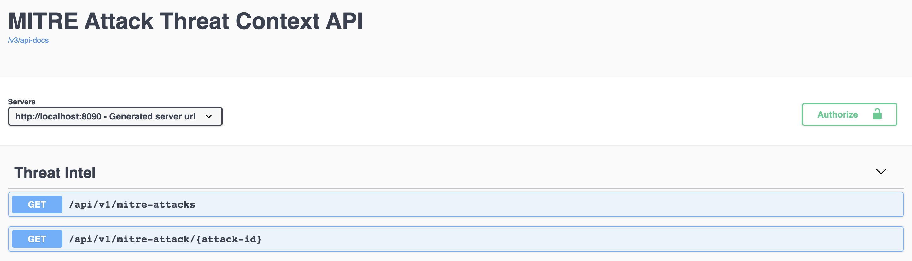
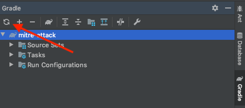
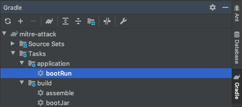

# Getting Started

### Development Environment Setup
1. Install Lombok plugin in IntelliJ: https://plugins.jetbrains.com/plugin/6317-lombok
2. IntelliJ > Preferences > Build, Execution, Deployment > Compiler > Annotation Processors > Enable
3. Lombok Plugin will ask to "Attach Annotations", click on that
4. Download JDK 11: https://www.oracle.com/technetwork/java/javase/downloads/jdk11-downloads-5066655.html
5. Restart IntelliJ
6. Find the IntelliJ menu bar then "File" -> "Open" -> Navigate to "Mitre-Attack/mitre-attack" and open "build.gradle" and click "Build as Project"
7. Once project is opened run Gradle import (red arrow bellow)

8. Once project is loaded, open Gradle menu (usually on the right) then "bootRun"

9. Open http://localhost:8090/swagger-ui.html in your browser

### Guides
The following guides illustrate how to use some features concretely:

* [Web Reactive](https://docs.spring.io/spring/docs/5.1.9.RELEASE/spring-framework-reference/web-reactive.html#webflux-fn)
* [Reactor 3 Reference Guide](https://projectreactor.io/docs/core/release/reference/)
* [Reactor Core](https://projectreactor.io/docs/core/release/api/)

### Additional Links
These additional references should also help you:

* [Gradle Build Scans – insights for your project's build](https://scans.gradle.com#gradle)
* [Official Gradle documentation](https://docs.gradle.org)
* [Spring Boot Gradle Plugin Reference Guide](https://docs.spring.io/spring-boot/docs/2.2.10.BUILD-SNAPSHOT/gradle-plugin/reference/html/)
